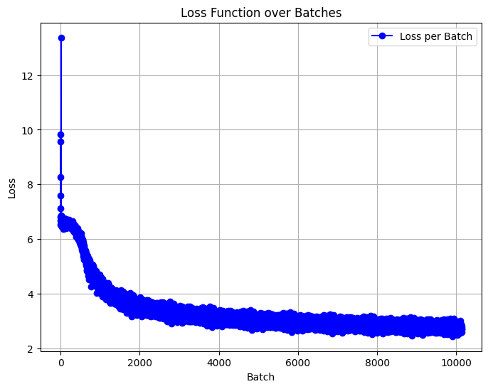

# v7 GPT Model Overview

This document provides an overview of the GPT model configuration and training used for the AI mode in `v7`, which predicts the next word based on the context of the input sequence.

## Model Configuration

The model `v7gpt` is a lightweight GPT-like architecture designed to handle Vietnamese language prediction tasks efficiently. Below are the key configuration details:

```python
class GPTConfig:
    block_size: int = 32 # Current max sequence length
    vocab_size: int = 17789 # All Vietnamese words + 1 padding token
    n_layer: int = 8 # number of layers
    n_head: int = 8 # number of heads
    n_embd: int = 256 # embedding dimension
```
- Total Parameters: 10,880,768
- Model Size: 43.6 MB

The model utilizes 8 layers with 8 attention heads per layer, and an embedding dimension of 256 to balance computational efficiency and language understanding.

## Dataset
The model was trained on the 5CD-AI/Vietnamese-alpaca-gpt4-gg-translated dataset.

## Training Details
The model was trained using the following setup:

- Optimizer: `AdamW`
 - Learning Rate: `0.003`
- Epochs: `10`
- Batch Size: `256` (1013 batch per epoch)
  
The training process involved minimizing the cross-entropy loss, which measures the difference between the predicted and actual next word. The final training loss achieved was `2.6115`.




This graph shows the model's loss decreasing over 10 epochs, indicating consistent improvements during training.

## Future Plans
The `v7gpt` model is designed to evolve over time. Future updates will include fine-tuning on better datasets, along with the possibility of combining it with the dictionary-based mode to create the most robust Vietnamese input method.