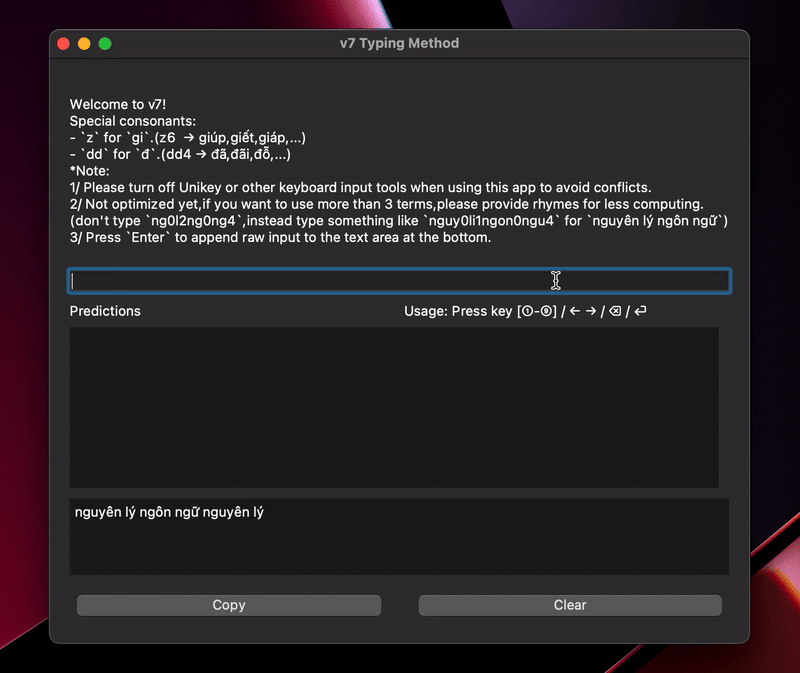

[**English**](README.md) | [**Tiếng Việt**](README_VI.md)

# Bộ gõ Tiếng Việt tối ưu v7

Dự án này phân tích tiếng Việt để phát triển một phương pháp gõ nhanh hơn bằng cách dự đoán từ dựa trên một phần từ muốn nhập. Ví dụ, chỉ cần nhập 'x0ch2' sẽ có thể dự đoán ra 'xin chào'.

## Cập nhật hiện tại
Chạy `pip install requirements.txt`, sau đó chạy `python app.py` để trải nghiệm (nên tắt VNI / Telex trước khi nhập).
🤝 **Hiện tại v7 chỉ có thể hoạt động thông qua app trên!**



**Bảng so sánh số lượng phím cần bấm để nhập một từ, cụm từ cho `Telex`/`VNI` và `v7`.**

Bảng thống kê này nhóm các cụm từ theo độ dài cụm từ. 

*Lưu ý: Số liệu được đánh giá qua trường hợp tốt nhất khi nhập bằng `v7`, giả sử rằng người dùng chỉ nhập `nguyên âm đầu` (hay còn gọi là **`âm`**) và `thanh điệu` (hay còn gọi là **`thanh`**) tương ứng, và cụm từ người dùng muốn nhập nằm trong từ điển và thuộc 9 cụm từ đoán được đầu tiên.*

| Độ dài cụm từ | Số lượng cụm từ | Số phím giảm<br>(so với VNI/Telex)<br>(± 1 std) | Tốc độ tăng<br>(so với VNI/Telex)<br>(± 1 std)|
|-|-|-|-|
| 1 | 6170 | 0.42 ± 1.12 | 3.1% ± 28.5%*  |
| 2 | 51614 | 4.74 ± 1.64 | 44.3% ± 9.9% |
| 3 | 6236 | 7.93 ± 2.09 | 49.0% ± 7.4% |
| 4+ <br>(không có trong từ điển) | 9589 | 8.79 ± 2.42 | 37.5% ± 5.1% |

So sánh cho thấy v7 có thể giảm mạnh số lượng phím và thời gian nhập khi người dùng cần nhập cụm từ trong từ điển, điều này giúp việc nhập tiếng Việt trở nên nhanh hơn vì ta thường dùng các cụm từ trong sinh hoạt, giao tiếp.

*\*: Khi nhập từ đơn, người dùng phải nhập toàn bộ chữ cái của từ, thêm vào đó là số `thanh`, đôi khi dẫn đến việc phải nhập nhiều hơn so với VNI/Telex (đây là điểm yếu chính của `v7`). Ví dụ: Để nhập `anh` bằng v7, người dùng phải nhập `anh0` và cần bấm thêm 1 số nữa để chọn trong số những dự đoán.*

<!-- Configuration:
```python
class InputMethod():
    def __init__(self, strict_k=False, flexible_k=True):
        self.strict_k = strict_k     # Do not accept `c`, `q`, if you want the words start with them, use `k` instead.
        self.flexible_k = flexible_k # Only works is strict_k is False: flexible_k helps `q`, `c`, and `k` yields the same predicted words of `k` family.
``` -->

## Sử dụng thư viện:
### Phân tách
Phân tách một từ tiếng Việt là quá trình chuyển 1 từ thành một bộ ba (tuple) `(họ_âm, họ_vần, thanh)`**. Quá trình này là nền móng cho việc phát triển bộ gõ `v7`. Đây là một hàm **không đơn ánh**, có thể có vài từ được phân tách ra cùng một bộ ba. Ví dụ: `cuốc` và `quốc` đều được phân tách ra là `('k', 'uông', 6)`; `mi` và `my` đều được phân tách ra là `('m', 'i', 0)`.

**: Chi tiết hơn về `họ_âm` (tượng trưng cho những phụ âm đầu giống nhau); `họ_vần` (tượng trưng cho những vần giống nhau); `thanh` có thể được tìm thấy trong file `vietnamese.py`.

Sử dụng `Vietnamese.analyze(word: str)` cho quá trình này.

```python
from vietnamese import Vietnamese

# Đoạn văn mẫu
corpus = "kiểm soát phối hợp tra cứu trực tiếp trên máy tính để phát hiện phương tiện vi phạm qua hình ảnh mà đã có thông báo chưa đến nộp phạt thì tổ tra cứu sẽ thông báo"

# Phân tách từng từ
for word in corpus.split(' '):
    print(Vietnamese.analyze(word))
```

***Kết quả*** **(họ_âm, họ_vần, thanh)**

```
('k', 'iêm', 3)
('s', 'oan', 6)
('ph', 'ôi', 1)
('h', 'ơm', 7)
('tr', 'a', 0)
('k', 'ưu', 1)
('tr', 'ưng', 7)
('t', 'iêm', 6)
('tr', 'ên', 0)
('m', 'ay', 1)
('t', 'inh', 1)
('đ', 'ê', 3)
('ph', 'an', 6)
('h', 'iên', 5)
('ph', 'ương', 0)
('t', 'iên', 5)
('v', 'i', 0)
('ph', 'am', 5)
('k', 'oa', 0)
('h', 'inh', 2)
('0', 'anh', 3)
('m', 'a', 2)
('đ', 'a', 4)
('k', 'o', 1)
('th', 'ông', 0)
('b', 'ao', 1)
('ch', 'ưa', 0)
('đ', 'ên', 1)
('n', 'ôm', 7)
('ph', 'an', 7)
('th', 'i', 2)
('t', 'ô', 3)
('tr', 'a', 0)
('k', 'ưu', 1)
('s', 'e', 4)
('th', 'ông', 0)
('b', 'ao', 1)
```

***Giải thích***

Tiếng Việt trên thực tế có **8 thanh điệu**, không phải 6 thanh điệu như nhiều người thường nghĩ. 6 ở đây thật ra là số lượng `dấu` (ngang/không dấu (`a`), sắc (`á`), huyền (`à`), hỏi (`ả`), ngã (`ã`), nặng (`ạ`)). Với những từ kết thúc bằng /p/, /t/, /c/, and /ch/, ta có thêm 2 `thanh` nữa!

Những từ với `thanh 7`: xuất, cấp, tất, chiếc, thích, mút... (họ vần theo thứ tự là: uân, âm, ân, iêng, inh, un).

Những từ với `thanh 8`: nhập, phục, đột, chục, mạch, kịp... (họ vần theo thứ tự là: âm, ung, ôn, ung, anh, im).

**Đây là khởi nguồn cho tên dự án v7: là từ `Việt` với thanh thứ 8 (nếu đếm từ 0 thì sẽ là 7).**

### Hợp nhất
Ngược lại với Phân tách, Hợp nhất là quá trình từ một bộ ba `(họ_âm, họ_vần, thanh)` ra một **dãy** (thay vì một từ vì tính chất ***không đơn ánh*** của Phân tách) nhưng thật ra trong đa số trường hợp, Hợp nhất sẽ cho một dãy chỉ có 1 phần tử.

Sử dụng `Vietnamese.synthesize(consonant: str, rhyme: str, tone: int)` hoặc `Dictionary.db[consonant][rhyme][tone]` cho quá trình này. Cả hai đều cho kết quả giống nhau nhưng cách thứ hai sẽ nhanh hơn vì nó truy xuất trực tiếp trên các khóa của Python Dictionary.

```python
from vietnamese import Vietnamese
from dictionary import Dictionary

print(Vietnamese.synthesize('k', 'u', 4))
print(Vietnamese.synthesize('k', 'uông', 6))
print(Vietnamese.synthesize('0', 'iên', 1))
print(Vietnamese.synthesize('0', 'i', 1))
print(Vietnamese.synthesize('z', 'i', 2))
print(Vietnamese.synthesize('ng', 'iêm', 7))
print(Vietnamese.synthesize('ng', 'iêm', 5))
print(Dictionary.db['z']['iên'][6])
print(Dictionary.db['d']['iên'][7])
print(Dictionary.db['k']['oeo'][5])
print(Dictionary.db['k']['oang'][0])
print(Dictionary.db['g']['i'][2])
print(Dictionary.db['z']['ăng'][7])
print(Dictionary.db['g']['i'][2])
print(Dictionary.db['kh']['ung'][3])
print(Dictionary.db['ng']['ênh'][2])
print(Dictionary.db['h']['oang'][3])
print(Dictionary.db['x']['uân'][6])
print(Dictionary.db['kh']['uênh'][2])
print(Dictionary.db['kh']['uênh'][7])
print(Dictionary.db['kh']['uênh'][6])
print(Dictionary.db['k']['oai'][1])
print(Dictionary.db['k']['ưu'][3])
# for c in Vietnamese.consonant_families:
#     print(Dictionary.db[c]['i'][0])
```
(Bỏ comment 2 dòng cuối để xem cách các `họ_âm` khác nhau ghép với `họ_vần` **`'i'`**)

***Kết quả*** 
```['cũ']
['cuốc', 'quốc']
['yến']
['í', 'ý']
['gì']
['nghiệp']
['nghiệm']
['giết']
['diệt']
['quẹo']
['quang']
['ghì']
['giặc']
['ghì']
['khủng']
['nghềnh']
['hoảng']
['xuất']
['khuềnh']
['khuệch']
['khuếch']
['quái']
['cửu']
```

### Nhập tiếng Việt bằng phương thức v7

Quá trình này tương tự với GIF ở trên. Có thể sử dụng code như dưới đây nếu muốn dùng trực tiếp bằng Python thay vì nhập trên app.

```python
from inputmethod import InputMethod
inputAgent = InputMethod()

print(inputAgent.predict('xi0chao2mo5ng2'))
print(inputAgent.predict('xi0chao2mo')) # Chưa đầy đủ
print(inputAgent.predict('ximg0ch2')) # Không khớp với từ nào (`ximg`)
print(inputAgent.predict('xi0')) # Khi nhập chỉ 1 từ và có sử dụng vần (ở đây dùng vần `i`), v7 sẽ dự đoán từ chính xác là `xi` (không dự đoán `xin`/`xinh`/...)
print(inputAgent.predict('b7')) # Không nhập vần -> Vần bất kỳ -> Kết quả là một dãy các từ bắt đầu bằng `b` và có thanh 7, giảm dần theo tần số sử dụng (dựa trên tập dữ liệu lớn)
print(inputAgent.predict('b7t2'))
print(inputAgent.predict('ba7ti2'))
print(inputAgent.predict('bac7ti2'))
```
***Kết quả*** 
```
['xin chào mộ người', 'xin chào mộ ngày', 'xin chào mọi người', 'xin chào mọi ngày', 'xinh chào mộ người', 'xinh chào mộ ngày', 'xinh chào mọi người', 'xinh chào mọi ngày']
None
None
['xi']
['biệt', 'bạc', 'bật', 'buộc', 'bạch', 'bậc', 'bột', 'bẹp', 'bọc', 'bịt', 'bọt', 'bạt', 'bực', 'bộc', 'bịp', 'bục', 'bịch', 'bệt', 'bụt', 'bặt', 'bập', 'bụp', 'bệch', 'buột', 'bẹc']
['biệt tài', 'bạc tình', 'bật tường', 'bạch tiền']
['bạc tình', 'bạch tiền']
['bạc tình']
```

### ...có thể tìm hiểu nhiều cách sử dụng hơn tại [`sandbox.py`](sandbox.py).

## Tham khảo:
[Hệ 8 thanh điệu trong tiếng Việt](https://en.wikipedia.org/wiki/Vietnamese_phonology#Eight-tone_analysis)


**Ngày tạo:** 10:05 Sáng, Thứ 3, 27 tháng 2 năm 2024

Nguồn dữ liệu:
- [Tập dữ liệu báo chí](https://github.com/binhvq/news-corpus)
- [Từ điển tiếng Việt 1](https://github.com/JaplinChen/rime-vietnamese-pinyin)
<!-- https://github.com/tienhapt/generalcorpus -->

<!-- Reference: -->
<!-- https://github.com/vncorenlp/VnCoreNLP -->
<!-- https://nlp.uit.edu.vn/datasets/#h.p_Uj6Wqs5dCpc4 -->
